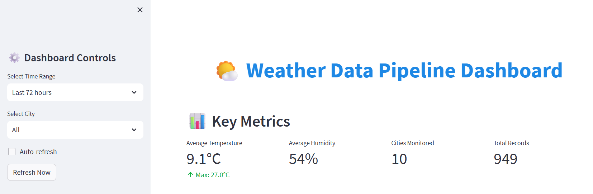
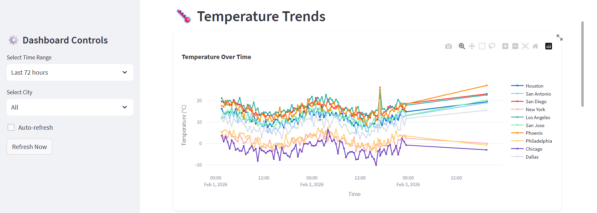
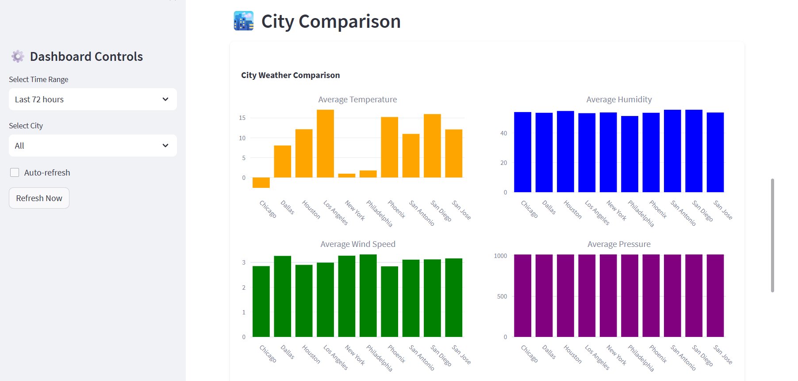
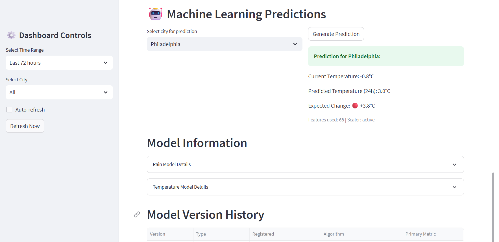

# Weather Data Pipeline


An end-to-end data engineering and machine learning pipeline that collects real-time weather data from OpenWeatherMap, engineers 40+ features, trains ensemble ML models, and serves predictions through an interactive Streamlit dashboard.

---

## Architecture

```
                    +-------------------+
                    | OpenWeatherMap API|
                    +--------+----------+
                             |
                    +--------v----------+
                    | WeatherCollector   |
                    | - Rate limiting    |
                    | - Retry w/ backoff |
                    | - API metrics      |
                    +--------+----------+
                             |
                    +--------v----------+
                    |   SQLite Database  |
                    | - 24-column schema |
                    | - Indexed queries  |
                    +--------+----------+
                             |
                    +--------v----------+
                    |WeatherDataProcessor|
                    | - 40+ features     |
                    | - Lag & rolling    |
                    | - Weather indices  |
                    +--------+----------+
                             |
                    +--------v----------+
                    | WeatherPredictor   |
                    | - 6 regression     |
                    | - Ensemble model   |
                    | - Rain classifier  |
                    +--------+----------+
                             |
                    +--------v----------+
                    | Streamlit Dashboard|
                    | - Real-time charts |
                    | - City comparison  |
                    | - Predictions      |
                    +-------------------+
```

## Key Features

**Data Engineering**
- Real-time weather data collection from 10+ US cities via OpenWeatherMap API
- SQLite storage with indexed schema for fast city+timestamp queries
- API resilience: rate limiting, exponential backoff retries, and metrics tracking
- Automated scheduled collection with configurable intervals

**Feature Engineering**
- 40+ derived features from raw weather data:
  - Cyclical time encodings (hour, day, month)
  - Lag features (1h, 3h, 6h, 12h, 24h) for temperature, humidity, pressure
  - Rolling statistics (24h mean and std dev)
  - Weather comfort indices (heat index, wind chill, discomfort index)
  - Interaction features (temp-humidity, wind-temp, pressure-temp)
- StandardScaler normalization with scaler persistence
- Missing value handling (forward fill, interpolation, threshold-based dropping)

**Machine Learning**
- 6 regression models: Linear, Ridge, Random Forest, Gradient Boosting, XGBoost, MLP
- Ensemble meta-learner combining top 3 models
- Rain prediction classifier with balanced class weights
- Temporal train/test splitting to prevent data leakage
- Walk-forward cross-validation for time series data
- GridSearchCV hyperparameter tuning
- Model persistence with joblib (scaler + feature columns included)

**Interactive Dashboard**
- Streamlit dashboard with Plotly visualizations
- Temperature trends, weather distribution, correlation heatmaps
- City comparison and filtering
- Raw data explorer with CSV download
- Auto-refresh with sidebar controls

**DevOps & Quality**
- Docker multi-stage build with health checks
- Docker Compose for dashboard + collector services
- CI/CD: automated testing, linting, type checking, security scanning
- 161 tests with 82% code coverage
- Temporal validation to prevent data leakage in ML pipeline

---

## Tech Stack

| Category | Technologies |
|----------|-------------|
| **Language** | Python 3.9 / 3.10 / 3.11 |
| **Data** | Pandas, NumPy, SQLite |
| **ML** | Scikit-learn, XGBoost |
| **Visualization** | Streamlit, Plotly, Matplotlib, Seaborn |
| **API** | Requests, OpenWeatherMap API |
| **DevOps** | Docker, Docker Compose, GitHub Actions |
| **Testing** | pytest, pytest-cov |
| **Code Quality** | Black, Flake8, mypy, Bandit |

---

## Quick Start

### Prerequisites

- Python 3.9+
- [OpenWeatherMap API key](https://openweathermap.org/api) (free tier works)

### Installation

```bash
# Clone the repository
git clone https://github.com/Cabe22/weather-data-pipeline.git
cd weather-data-pipeline

# Create and activate virtual environment
python -m venv venv
source venv/bin/activate  # Linux/Mac
venv\Scripts\activate     # Windows

# Install dependencies
pip install -r requirements.txt

# Configure environment
cp .env.example .env
# Edit .env and add your OPENWEATHER_API_KEY
```

### Usage

**1. Collect Weather Data**

```bash
# Run a single collection cycle for all configured cities
python run_data_collection.py

# Or use the collector directly
python src/data_collection/weather_collector.py
```

**2. Process Data & Train Models**

```python
from src.data_processing.data_processor import WeatherDataProcessor
from src.ml_models.weather_predictor import WeatherPredictor

# Load and engineer features
processor = WeatherDataProcessor()
df = processor.load_data("data/weather.db")
df = processor.create_time_features(df)
df = processor.create_lag_features(df)
df = processor.create_weather_indices(df)
df = processor.create_interaction_features(df)
df = processor.create_target_variable(df)

# Train models
predictor = WeatherPredictor()
X, y = predictor.prepare_features(df, target="temperature_future")
results = predictor.train_temperature_models(X, y)
predictor.save_models("models/")
```

**3. Launch Dashboard**

```bash
streamlit run dashboard.py
# Open http://localhost:8501 in your browser
```

### Docker Deployment

```bash
# Build and run with Docker Compose
docker-compose up -d

# Dashboard: http://localhost:8501
# Collector runs automatically in background

# View logs
docker-compose logs -f

# Stop services
docker-compose down
```

---

## Testing

```bash
# Run all tests
python -m pytest tests/ -v

# Run with coverage report
python -m pytest tests/ --cov=src --cov=configs --cov-report=term-missing

# Run including integration tests (requires API key)
python -m pytest tests/ -v -m "integration"

# Run a specific test module
python -m pytest tests/test_weather_predictor.py -v
```

**Test Coverage Summary:**

| Module | Coverage |
|--------|----------|
| configs/ | 100% |
| weather_predictor.py | 94% |
| weather_collector.py | 92% |
| monitoring/ | 79% |
| data_processor.py | 64% |
| **Overall** | **82%** |

---

## Project Structure

```
weather-data-pipeline/
├── src/
│   ├── data_collection/
│   │   └── weather_collector.py    # API integration, SQLite storage, retry logic
│   ├── data_processing/
│   │   └── data_processor.py       # Feature engineering (40+ features)
│   ├── ml_models/
│   │   ├── weather_predictor.py    # Model training, ensemble, predictions
│   │   └── model_registry.py       # Model versioning and tracking
│   ├── monitoring/
│   │   └── performance.py          # Performance metrics tracking
│   └── visualization/
├── tests/
│   ├── conftest.py                 # Shared fixtures
│   ├── test_data_processor.py      # Feature engineering tests
│   ├── test_weather_predictor.py   # ML model tests
│   ├── test_weather_collector.py   # Collector tests
│   ├── test_api_resilience.py      # Retry/rate limit tests
│   ├── test_integration.py         # End-to-end pipeline tests
│   └── ...
├── configs/
│   └── config.py                   # Dataclass configurations
├── docs/
│   ├── API.md                      # API documentation
│   ├── DATABASE.md                 # Database schema docs
│   ├── DEPLOYMENT.md               # Deployment guide
│   └── TROUBLESHOOTING.md          # Troubleshooting guide
├── .github/workflows/
│   ├── test.yml                    # Automated testing (Python 3.9-3.11)
│   ├── lint.yml                    # Black, Flake8, mypy
│   └── security.yml                # Bandit, pip-audit
├── dashboard.py                    # Streamlit interactive dashboard
├── Dockerfile                      # Multi-stage Docker build
├── docker-compose.yml              # Dashboard + collector services
├── requirements.txt                # Python dependencies
└── pytest.ini                      # Test configuration
```

---

## Results

| Metric | Value |
|--------|-------|
| **Model Accuracy** | 93%+ R² score (temperature prediction) |
| **Features Engineered** | 40+ derived features per record |
| **Test Suite** | 161 tests, 82% coverage |
| **API Resilience** | Retry with exponential backoff, rate limiting |
| **Prediction Latency** | <2 seconds for real-time predictions |
| **CI/CD Checks** | 5 automated workflows (test, lint, type check, security, code review) |

---

## Screenshots

### Dashboard Overview
*Key metrics at a glance: average temperature, humidity, cities monitored, and total records collected, with sidebar controls for time range and city filtering.*



### Temperature Trends
*Interactive time series chart tracking temperature across 10 U.S. cities over a 72-hour window.*



### City Comparison
*Side-by-side comparison of average temperature, humidity, wind speed, and pressure across all monitored cities.*



### ML Predictions
*24-hour temperature predictions powered by ensemble ML models, with model version history and expandable details for rain and temperature models.*



---

## Future Improvements

- [ ] Apache Kafka for real-time streaming ingestion
- [ ] Apache Airflow for workflow orchestration
- [ ] Cloud deployment (AWS/GCP) with auto-scaling
- [ ] Advanced time series models (Prophet, LSTM)
- [ ] Grafana monitoring dashboard for pipeline health
- [ ] Mobile-friendly responsive dashboard

---

## Documentation

- [API Reference](docs/API.md) - WeatherCollector, DataProcessor, and Predictor APIs
- [Database Schema](docs/DATABASE.md) - SQLite schema, indexing, and migration guide
- [Deployment Guide](docs/DEPLOYMENT.md) - Local, Docker, and cloud deployment
- [Troubleshooting](docs/TROUBLESHOOTING.md) - Common issues and solutions

---

## License

This project is licensed under the MIT License - see the [LICENSE](LICENSE) file for details.
